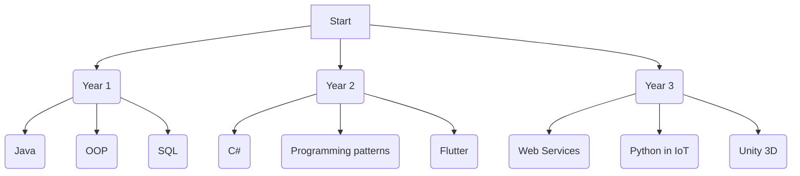

# Hello! My name is Nabil 🐬

> I'm a Vanier student, studying computer science technology. I'm excited to learn new things and create cool projects.
> > 🎓 Currently looking for internship for my last semester to learn about job environment
> > > 💻 interested in any hackathon to learn outside my environment !

## Currently Studying at college and outside!
- More PHP, Web Services &nbsp;
- More C#   &nbsp;
- Unity 3D 
- Networks 
- Python in Iot &nbsp;
- Blender 
- Node.js 
- react 

## Languages and Tools 🛠️

      <b>Web Application Development:</b> 
    &nbsp;
 &nbsp;
  &nbsp;
  &nbsp
  &nbsp;
  &nbsp;
  &nbsp;

<b>Application Development:</b> 
  &nbsp;
  &nbsp;
  &nbsp;
  &nbsp;
  &nbsp;
  &nbsp;

  <b>IoT: Internet of Things:</b> 
    &nbsp;
    &nbsp;
&nbsp;
  &nbsp;
  &nbsp;

<b>Tools and IDE:</b> 
    
  &nbsp;
  &nbsp;
  &nbsp;
    &nbsp;
  &nbsp; 

