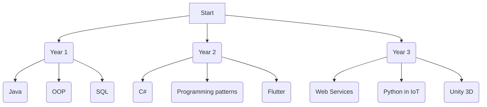

# Hello! My name is Nabil

> I'm a Vanier student studying computer science technology. I'm excited to learn new things and create cool projects.

## Currently Studying
- More PHP, Web Services
- More C#
- Unity 3D
- Networks
- Python in Iot 

| Language/Technology | Proficiency |
|---------------------|-------------|
| C#									| Advanced    |
| SQL                 | Advanced    |
| JavaScript          | Intermediate|
| HTML/CSS            | Intermediate|
| Java                | Intermediate|
| PHP                 | Intermediate|
| Flutter             | Intermediate|
|Networks             | Intermediate|
|IoT                  | Beginner    |
| Python              | Beginner    |
| Unity 3D            | Beginner    |
